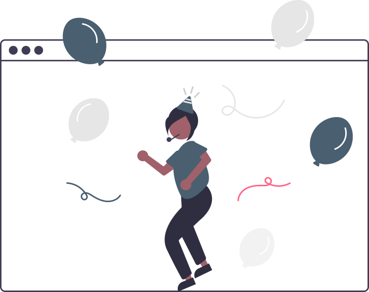

<!--
**CBTheDeveloper/CBTheDeveloper** is a ✨ _special_ ✨ repository because its `README.md` (this file) appears on your GitHub profile.

Here are some ideas to get you started:

- 🔭 I’m currently working on ...
- 🌱 I’m currently learning ...
- 👯 I’m looking to collaborate on ...
- 🤔 I’m looking for help with ...
- 💬 Ask me about ...
- 📫 How to reach me: ...
- 😄 Pronouns: ...
- ⚡ Fun fact: ...
-->
# Hey Hey Hey, it's a PARTY🎉

## This is my do over party in my career in tech and in Github as well. Life has really made me realize how each day I am alive, I need to celebrate. In the mist of everything I have one take away that I will like to share, <em>When you start to become unhappy in your moment, it is time for a change!</em>    My change is here and now and since there is no turning back, I am going to share this with you:

🔭 I’m currently working on:  
* Going back to basics of HTML, CSS, JS ( I been away for for almost 2 years of working with WP so refreshing is a must)
* Picking up TailwindCSS
* Simply put, brushing up on my frontend skills!

🌱 I’m currently learning:  
* All things JAMStack!!! - I have been MIA and I really want to dive in DEEP into this stack
* Serverless Functions and Headless CMS (old habits die hard with WP but I will experiment with others, I promise 😊)
* Laravel Ecosystem - Really want to step outside the box and experiment a tincy bit!

⚡ Fun fact about me is that my name has always been mispronounced because it is !spelled correctly since birth, AIN'T NO BODY GOT TIME TO CHANGE IT, this is why I never get mad or frustrated when it is pronounced wrong 🤣

